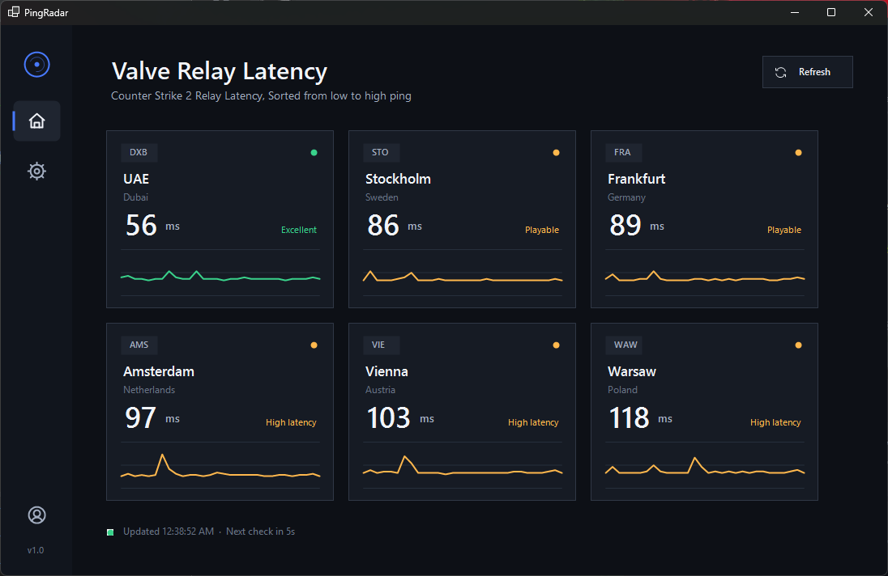

# PingRadar

**PingRadar** is a lightweight Windows desktop app built with **C# WinForms** for checking Counter-Strike 2 / Valve relay latency.

It displays available relay/server regions, their current ping, and a simple connection-quality label so you can quickly see which region gives the best route before playing.

## Features

- Shows Valve relay latency by region
- Sorts servers from lowest to highest ping
- Displays region code, city, and country
- Marks connection quality such as `Excellent`, `Playable`, or `High latency`
- Includes a manual refresh button
- Clean dark UI designed for quick reading

## Status

Early version / work in progress.
